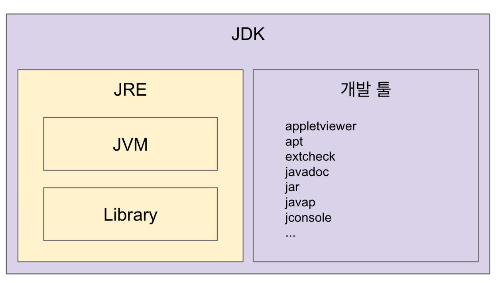
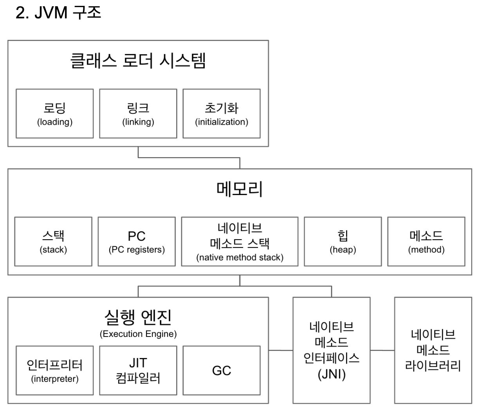

--------------------
# Java
--------------------

# 목차

- [1. 자바 JVM JDK 그리고 JRE](#자바-JVM-JDK-그리고-JRE)
    - [1. JVM](#JVM)
    - [2. JRE](#JRE)
    - [3. JDK](#JDK)
    - [4. JAVA](#JAVA)
- [2. JVM 구조](#JVM-구조)
    - [1. 클래스 로더 시스템](#클래스-로더-시스템)
    - [2. 메모리](#메모리)
        - [1. 스택](#스택)
        - [2. 네이티브 메소드](#네이티브-메소드)
        - [3. 실행 엔진](#실행-엔진)
        - [4. 참고](#참고)
- [3. 클래스 로더](#클래스-로더)
    - [1. 로딩](#로딩)
    - [2. 링크](#링크)
- [4. 바이트코드 조작](#바이트코드-조작)
    - [1. 바이트코드 조작 예제](#바이트코드-조작-예제)
    - [2. ByteBuddy](#ByteBuddy)
    - [3. javaagent 실습](#javaagent-실습)
- [5. 바이트코드 조작 정리](#바이트코드-조작-정리)
    - [1. 참고](#참고)
- [6. 리플렉션 API 클래스 정보 조회](#리플렉션-API-클래스-정보-조회)
- [7. 애노테이션과 리플렉션](#애노테이션과-리플렉션)
    - [1. 인터페이스 어노테이션 상속](#인터페이스-어노테이션-상속)
    - [2. 어노테이션 필드의 값을 참조하는 방법](#어노테이션-필드의-값을-참조하는-방법)
- [8. 클래스 정보 수정 또는 실행](#클래스-정보-수정-또는-실행)
- [9. 나만의 DI 프레임워크 만들기](#나만의-DI-프레임워크-만들기)
- [10. 리플렉션 정리](#리플렉션-정리)
- [11. 프록시 패턴](#프록시-패턴)
    - [1. 코드 예제](#코드-예제)
- [12. 다이나믹 프록시 실습](#다이나믹-프록시-실습)
- [13. 클래스의 프록시가 필요하다면?](#클래스의-프록시가-필요하다면?)
    - [1. byte-buddy 프록시 설정](#byte-buddy-프록시-설정)
- [14. 롬복(ProjectLombok) 작동 원리](#롬복(ProjectLombok)-작동-원리)
- [15. 애노테이션 프로세서](#애노테이션-프로세서)
    - [1. 코드 예제](#코드-예제)
    - [2. 소스코드 생성하기](#소스코드-생성하기)
- [16. 애노태이션 프로세서 정리](#애노태이션-프로세서-정리)

# 자바 JVM JDK 그리고 JRE

- JDK
    - JRE
        - JVM
        - Library
    - 개발 툴
        - appletviewer
        - apt
        - jar...

## JVM

Java Virtual Machine

- 자바 가상 머신으로 자바 바이트 코드(.class 파일)를 `OS에 특화된 코드로 변환(인터프리터와 JIT 컴파일러)하여 실행`한다. 그러므로 OS에 의존적이므로 종속적을 가집니다.
- `바이트 코드를 실행하는 표준`(JVM 자체는 표준)이자 구현체(특정 밴더가 구현한 JVM)다.
- JVM스팩: https://docs.oracle.com/javase/specs/jvms/se11/html/
- JVM 밴터: 오라클, 아마존, Azul, ...
- 특정 플랫폼에 `종속적`

최초의 JVM은 JAVA만 지원해주기 위해서 만들어 졌지만 JAVA언어와 직접적인 연관 관계가 있는것이 아니라 중간에 클레스 파일만 있으면 실행을 해주는(JRE) 존재해서 연관성이 타이트하지 않습니다. 
즉 어떠한 다른 프로그래밍 코드로 코딩을 하더라도 해당 언어로 컴파일 했을때 class 파일이 만들어 지거나 Java 파일 만들어 주기만하면 JVM을 활용할 수 있습니다. 

`플랫폼에 독립적인 언어`
Java 코드 자체가 플랫폼이 아닌 `가상머신에 종속적`이라는 점, 그리고 프로그램 실행의 주체가 `운영체제가 아닌 JVM`이라는 점 때문이며 이러한 점을 통틀어 Java는 플랫폼 종속성이 낮은 언어라고 표현

- `수많은 개발자와 레퍼런스를 보유` 
- 기기 호환성
    - 해당 운영체제에 Java Virtual Machine(JVM)을 설치하면 Java로 만든 프로그램은 어떤 컴퓨터에서도 완벽히 똑같이 동작
- 안정성
    - 객체지향의 목적 자체가 재사용을 통한 생산성의 향상과 관리 상의 이점인데, 다중 상속은 잘못 사용할 시 극도로 복잡하게 꼬인 프로그램을 만들 위험성 `다중상속을 언어 스펙에서 제거`

## JRE

Java Runtime Environment

JVM은 혼자 배포할 수 없습니다. 
`최소 배포 단위는 JRE` 입니다.

- `자바 애플리케이션을 실행`할 수 있도록 구성된 배포판.
- JVM과 핵심 라이브러리 및 자바 런타임 환경에서 사용하는 프로퍼티 세팅이나 리소스 파일을 가지고 있다.(JVM + 라이브러리)
- 개발 관련 도구는 포함하지 않는다. (JDK에서 제공)

## JDK

Java Development Kit

- JRE + 개발에 필요한 툴
- 소스 코드를 작성할 때 사용하는 자바 언어는 플랫폼에 독립적
- 오라클은 자바 11부터는 `JDK만 제공하며 JRE를 따로 제공하지 않는다.`

## JAVA

- 프로그래밍 언어
- JDK에 들어있는 자바 컴파일러(javac)를 사용하여 바이트코드(.class 파일)로 컴파일 할 수 있다.
- 오라클에서 만든 Oracle JDK 11 버전부터 상용으로 사요할 때 유료.

JIT 컴파일러: https://aboullaite.me/understanding-jit-compiler-just-in-time-compiler/
JDK, JRE 그리고 JVM: https://howtodoinjava.com/java/basics/jdk-jre-jvm/
https://en.wikipedia.org/wiki/List_of_JVM_languages

# JVM 구조

## 클래스 로더 시스템

JAVA 바이트 코드를 읽어 들여서 `메모리에 적절하게 배치`하는게 클래스 로더가 하는일입니다.

- .class 에서 바이트코드를 읽고 메모리에 저장
- 로딩: 클래스 읽어오는 과정
- 링크: 레퍼런스를 연결하는 과정
- 초기화: static 값들 초기화 및 변수에 할당

> static 값 예제

~~~
public class Application {
    public Application() { }

    static String myName;
    static {
        myName = "jjunpro";
    }
}

public class WhiteShip {
    public WhiteShip() { }

    public void hello() {
        String myName = Application.myName;
        // static 선언으로 다른 class 에서 불러올 수 있습니다.
    }
}
~~~

## 메모리

- 메모리 영역에는 `클래스 수준의 정보 (클래스 이름, 부모 클래스 이름, 메소드, 변수) 저장.` 공유 자원이다.
- 힙 영역에는 `객체를 저장.` 공유 자원이다.
- 스택 영역에는 `쓰레드 마다 런타임 스택`을 만들고, 그 안에 `메소드 호출을 스택 프레임이라 부르는 블럭으로 쌓는다.` 쓰레드 `종료하면 런타임 스택도 사라진다.`
- PC(Program Counter) 레지스터: `쓰레드 마다 쓰레드 내 현재 실행할 스택 프레임을 가리키는 포인터가 생성`된다.
- 네이티브 메소드 스택
- https://javapapers.com/core-java/java-jvm-run-time-data-areas/#Program_Counter_PC_Register

아무것도 상속받지 않은 클래스도 기본적으로 Object 클래스를 상속받습니다. 

~~~
public class Application {
    public static void main(String[] args) {
        // Super Class 출력 예제
        String superClass = Application.class
                .getSuperclass()
                .toString();
        System.out.println("Super Class : " + superClass);
    }
}

- 결과

Super Class : class java.lang.Object
~~~

Application.class 에 들어있는 메소드, 변수들 모드 메소드 영역에 저장이 되고 공유하는 자원이 됩니다. 다른 영역에서도 참조할 수 있는 정보들입니다.

힙, 메소드를 제외한 다른것들은 쓰레드에서만 공유하는 자원

### 스택

쓰레드마다 런타임 스택이라는것을 만들고 그 안에 스택 프레임(메소드 콜)을 쌓습니다.
예를 들어서 에러 메세지를 볼때 메서드가 쌓여서 출력되는것을 확인합니다. 
이런 스택은 쓰레드 마다 하나씩 만들어 집니다.
만들어진 스택에 메소드를 쌓은 위치를 가르키는 PC registers 가 생깁니다.
이것또한 해당 쓰레드마다 생기고 국한 됩니다.

### 네이티브 메소드

메소드에 네이티브라는 키워드가 붙어 있고 그 구현을 자바가 아닌 C,C++.. 로 한것을 의미

- JNI(Java Native Interface)
    - 자바 애플리케이션에서 C, C++, 어셈블리로 작성된 함수를 사용할 수 있는 방법 제공
    - Native 키워드를 사용한 메소드 호출
    - https://medium.com/@bschlining/a-simple-java-native-interface-jni-example-in-java-and-scala-68fdafe76f5f  

실제 구현된 그 자체를 `네이티브 메소드 라이브러리` 라고 부르고 있습니다.
해당 라이브러리는 `네이티브 메소드 인터페이스(JNI)`를 통해서 사용해야 합니다.
네이티브 메소드를 사용하는 코드가 존재한다면 `네이티브 메소드 스택`이 생기고 JNI 를 불러오는 스택 프레임이 하나 쌓이게 됩니다.

간단 예제

~~~
Thread.currentThread();
>
public static native Thread currentThread();
~~~  

## 실행 엔진

실행을 하면서 스택을 사용합니다.
한줄씩 하는것이 비효율적이므로 JIT 사용하고 메모리도 최적화 해줘야 하니까 남는 레퍼런스 인스턴스를 찾아서 정리도 해줍니다.

- 인터프리터: 바이크 코드를 한줄 씩 실행.
- JIT(just-in-time compilation) 컴파일러: 인터프리터 효율을 높이기 위해, `인터프리터가 반복되는 코드`를 발견하면 JIT 컴파일러로 반복되는 코드를 `모두 네이티브 코드로 바꿔둔다.` 그 다음부터 인터프리터는 네이티브 코드로 컴파일된 코드를 바로 사용한다.
- GC(Garbage Collector): 더이상 `참조되지 않는 객체`를 모아서 `정리한다.`

## 참고
- https://www.geeksforgeeks.org/jvm-works-jvm-architecture/
- https://dzone.com/articles/jvm-architecture-explained
- http://blog.jamesdbloom.com/JVMInternals.html

# 클래스 로더

- 로딩, 링크, 초기화 순으로 진행된다.

## 로딩

- 로딩
    - 클래스 로더가 `.class 파일을 읽고` 그 내용에 따라 적절한 `바이너리 데이터`를 만들고 `“메소드” 영역에 클래스 정보를 저장.`
    - 이때 메소드 영역에 저장하는 클래스 정보 데이터
        - FQCN(Fully Qualified Class Name) 패키지이름, 클래스 이름, 클래스 로더 까지
        - 클래스 | 인터페이스 | 이늄
        - 메소드와 변수
    - 로딩이 끝나면 해당 클래스 타입의 `Class 객체를 생성하여 “힙" 영역에 저장.`

> Class 객체를 생성하여 “힙" 영역에 저장 예제

~~~
public class WhiteShip {
    public WhiteShip() {}

    // 클래스 로더 Class 객체를 생성하여 “힙" 영역에 저장 예제
    public void work() {
        /*
        * 예제로 WhiteShip.class 가 로딩되면 class 타입의 인스턴스가 WhiteShip.class 저장이 됩니다.
        * 그래서 static 하게 접근이 가능합니다.
        * */
        WhiteShip.class;

        /*
        * 아니면 인스턴스가 존재한다면 whiteShip.getClass() 해서 접근할 수 있습니다.
        * */
        WhiteShip whiteShip = new WhiteShip();
        whiteShip.getClass();

        /*
        * Class 객체도 만들어져서 접근이 가능합니다.
        * */
        Class<WhiteShip> whiteShipClass;
        whiteShip.getClass();
    }
}
~~~

- 부트 스트랩 클래스 로더 -  JAVA_HOME\lib에 있는 코어 자바 API를 제공한다. 최상위 우선순위를 가진 클래스 로더
- 플랫폼 클래스로더 - JAVA_HOME\lib\ext 폴더 또는 java.ext.dirs 시스템 변수에 해당하는 위치에 있는 클래스를 읽는다.
- 애플리케이션 클래스로더 - 애플리케이션 클래스패스(애플리케이션 실행할 때 주는 -classpath 옵션 또는 java.class.path 환경 변수의 값에 해당하는 위치)에서 클래스를 읽는다.

App을 읽어 들인 클래스로더 확인하는 방법

~~~
public class Application {
    public Application() {}

    public static void main(String[] args) {
        // Application에서 사용중인 클래스로더 확인하기
        ClassLoader classloader = Application.class.getClassLoader();
        System.out.println("Class Loader : " + classloader.toString());

        // 클래스로더 계층형 구조 확인하기
        System.out.println("Class Loader Parent : " + classloader.getParent());
        System.out.println("Class Loader Parent Parent: " + classloader
                .getParent()
                .getParent());
    }
}

결과-

Super Class : class java.lang.Object
Class Loader : jdk.internal.loader.ClassLoaders$AppClassLoader@1de0aca6
Class Loader Parent : jdk.internal.loader.ClassLoaders$PlatformClassLoader@1c4af82c
Class Loader Parent Parent: null
~~~

현재 Application의 클래스 로더는 `AppClassLoader`
AppClassLoader 의 부모는 `PlatformClassLoader`
PlatformClassLoader 의 부모는 존재하기는 하지만 네이티브 코드로 구현이 되어있어서 볼 수가 없습니다.
최상위 부트 스트랩 클래스 로더가 네이티브 클래스로더로 구현이 되어있어서 자바코드에서 참조해서 출력할 수 없습니다.

클래스 로더가 동작하는 원리는 어떠한 클래스를 읽어달라고 하면 해당 클래스를 읽어 올때 최상위 부모를 거칩니다. 
최상위 부모가 못 읽으면 그 다음 부모 로더가 읽고
다음 부모도 못 읽으면 본인 로더가 읽습니다. 
만약 모든 로더가 읽을 수가 없다면 class not found 오류가 발생합니다.

## 링크

- `Verify, Prepare, Reolve(optional)` 세 단계로 나눠져 있다.
- 검증: .class 파일 형식이 `유효한지 체크`한다.
- Preparation: `메모리를 준비하는 과정` 클래스 변수(static 변수)와 기본값에 필요한 메모리
- Resolve: `심볼릭 메모리` 레퍼런스를 메소드 영역에 있는 `실제 레퍼런스로 교체`한다.

심볼릭 메모리에제

~~~
WhiteShip whiteShip = new WhiteShip();
~~~

WhiteShip 는 심볼릭 레퍼런스 입니다.
실제 레퍼런스를 가리키고 있지 않습니다.
심볼릭 레퍼런스를 실제 힙 영역에 들어있는 레퍼런스를 가리키도록 일어날 수도 안일어날 수도 있는 옵셔널 상태입니다.

# 바이트코드 조작

코드 커버리지란 테스트 코드가 원본 코드의 얼마만큼 커버(테스트) 했는지 확인하는 것

~~~
public class Moim {
    public int maxNumberOfAttendees;
    public int numberOfEnrollment;

    public Boolean isEnrollmentFull() {
        if (maxNumberOfAttendees == 0) {
            return false;
        }
        if (numberOfEnrollment < maxNumberOfAttendees) {
            return false;
        }
        return true;
    }
}

public class MoimTest {
    @Test
    public void isFull() {
        Moim moim = new Moim();
        moim.maxNumberOfAttendees = 100;
        moim.numberOfEnrollment = 10;

        Assert.assertFalse(moim.isEnrollmentFull());
    }
}
~~~

- 테스트 코드가 확인한 소스 코드를 %
    - JaCoCo를 써보자.
    - (gradle 적용방법) https://docs.gradle.org/current/userguide/jacoco_plugin.html
    - https://www.eclemma.org/jacoco/trunk/doc/index.html
    - http://www.semdesigns.com/Company/Publications/TestCoverage.pdf

~~~
plugins {
    id 'jacoco'
}

jacoco {
    toolVersion = "0.8.5"
    reportsDir = file("$buildDir/customJacocoReportDir")
}

jacocoTestReport {
    reports {
        xml.enabled false
        csv.enabled false
        html.destination file("${buildDir}/jacocoHtml")
    }
}

jacocoTestCoverageVerification {
    violationRules {
        rule {
            limit {
                minimum = 0.9
            }
        }
    }
}
~~~

jacoco run을 실행하면 해당 코드의 테스트가 진행되지 않은 부분을 알려줍니다.
이런 코드는 어떻게 만들어 지는지 알아보도록 하겠습니다.

바이트 코드를 읽어서 코드 커버리지를 챙겨야 하는 부분을 하나씩 체크를 합니다.
코드가 실행이 될 때 그 중에서 몇개를 지나갔는지 체크를 합니다.
다음 비교를 합니다 어디를 지나갔고 어디를 안지나 갔는지 계산도해서 출력합니다.

jacocoTestCoverageVerification 평가 점수가 90% 이상일 경우 통과되도록 설정도 존재함

## 바이트코드 조작 예제

~~~
public class Moja {
    public Moja() {}

    public String pullOut() {
        return "";
    }
}

public class ShowAction {
    public ShowAction() {}

    public static void main(String[] args) {
        Moja moja = new Moja();
        System.out.println("Show Action : " + moja.pullOut());
    }
}
~~~

아무것도 존재하지 않는 Moja.class의 pullOut 메소드에서 값을 바이트 코드를 조작해서 출력해보도록 하겠습니다.

- 바이트코드 조작 라이브러리
    - ASM: https://asm.ow2.io/ (visit 패턴, adapter 패턴을 모르면 쓰기 어려움)
    - Javassist: https://www.javassist.org/
    - ByteBuddy: https://bytebuddy.net/#/ (추천)

## ByteBuddy

의존성 추가

~~~
compile group: 'net.bytebuddy', name: 'byte-buddy', version: '1.10.6'
~~~

~~~
public class ShowAction {
    public ShowAction() {
    }

    public static void main(String[] args) throws IOException {
        // 1.
        ByteBuddy byteBuddy = new ByteBuddy();
        byteBuddy.redefine(Moja.class)    // Moja class를 재 정의합니다.
                .method(named("pullOut")) // Moja class 선언된 pullOut 메소드를 선택
                .intercept(FixedValue.value("Action!!")) // pullOut 메소드의 값을 변경
                .make()
                .saveIn(new File("/Users/kimminseok/git-repository/Java/바이트코드 조작/project/build/classes/java/main/")); // 폴더를 지정합니다.

        // 2.
        Moja moja = new Moja();
        System.out.println("Show Action : " + moja.pullOut());
    }
}
~~~

순서대로 2번을 주석 후 실행하면 바이트코드가 변경됩니다.
1번 주석 후 실행하면 변경된 바이트코드 class 실행됩니다.
컴파일을 하지않는이상 변경된 정보로 출력됩니다.

## javaagent 실습

- Javaagent JAR 파일 만들기
    - https://docs.oracle.com/javase/8/docs/api/java/lang/instrument/package-summary.html
    - 붙이는 방식은 시작시 붙이는 방식 premain과 런타임 중에 동적으로 붙이는 방식 agentmain이 있다.
    - Instrumentation을 사용한다.

- Javaagent 붙여서 사용하기
    - 클래스로더가 클래스를 읽어올 때 javaagent를 거쳐서 변경된 바이트코드를 읽어들여 사용한다.

바이트코드가 변경되기전 작업을 해주는 에이전트(Agent) 대리인을 구현합니다.
Agent 프로젝트를 하나 생성합니다.

> project-agent

의존성을 추가합니다.

~~~
compile group: 'net.bytebuddy', name: 'byte-buddy', version: '1.10.6'
~~~

~~~
public class Applcation {
    public static void premain(String agentArgs, Instrumentation inst) {
        new AgentBuilder.Default() // AgentBuilder 기본 빌더를 가져옵니다.
                .type(ElementMatchers.any()) // 아무 타입을 가져옵니다.
                .transform((builder, typeDescription, classLoader, module) -> builder
                        .method(named("pullOut"))
                        .intercept(FixedValue.value("Action!!")))
                .installOn(inst); // 인스트루먼테이션(instrumentation) 저장
    }
}
~~~

해당 agent를 JAR로 패키징 하면서 파일 내부에 특정한 설정값을 넣어줘야 합니다.

[Manifest Attributes](https://docs.oracle.com/javase/8/docs/api/java/lang/instrument/package-summary.html)

필수로 넣어야하는 설정값 
- Premain-Class (에이전트가 지정된 경우이 속성은 에이전트 클래스를 지정
- Can-Redefine-Classes (에이전트에 필요한 클래스를 재정의하는 기능
- Can-Retransform-Classes (에이전트에 필요한 클래스를 다시 변환하는 기능

[Customize JAR manifest entries with Maven/Gradle](http://andresalmiray.com/customize-jar-manifest-entries-with-maven-gradle/)

~~~
jar {
    manifest {
        attributes(
                'Built-By': System.properties['user.name'],
                'Build-Timestamp': new java.text.SimpleDateFormat("yyyy-MM-dd'T'HH:mm:ss.SSSZ").format(new Date()),
                'Build-Revision': versioning.info.commit,
                'Created-By': "Gradle ${gradle.gradleVersion}",
                'Build-Jdk': "${System.properties['java.version']} (${System.properties['java.vendor']} ${System.properties['java.vm.version']})",
                'Build-OS': "${System.properties['os.name']} ${System.properties['os.arch']} ${System.properties['os.version']}",

                // custom code
                'Premain-Class': "me.whiteship.Application",
                'Can-Redefine-Classes': true,
                'Can-Retransform-Classes': true
        )
    }
}
~~~

agent 프로젝트를 JAR 패키징 합니다.
JAR 파일이 저장된 위치정보를 복사합니다.

> project-byte

~~~
public class Moja {
    public Moja() {
    }

    public String pullOut() {
        return "No Update";
    }
}

public class ShowAction {
    public ShowAction() {
    }

    public static void main(String[] args) {
        Moja moja = new Moja();
        System.out.println("Show Action : " + moja.pullOut());
    }
}

결과 -

Show Action : Action!!
~~~

Edit Configurations -> VM options -> -javaagent:/Users/kimminseok/git-repository/Java/bytecode/project-byte/build/libs/project-byte-1.0-SNAPSHOT.jar

-javaagent: 위치에 agent JAR 파일 경로를 붙여넣기하고 run을 실행하면
바이트코드가 조작되어 출력됩니다.

Project-1 project-byte 프로젝트의 바이트코드를 확인하면 값이 변경되지 않은것을 확인할 수 있습니다.
이는 클래스가 로딩이 될때 바이트코드가 변경되기 때문에 메모리 내부에서는 값이 변경되어 있습니다.

이를 Transparent 비 침투적인 기존 코드를 건드리지않습니다.

# 바이트코드 조작 정리

- 프로그램 분석
    - 코드에서 버그 찾는 툴
    - 코드 복잡도 계산
- 클래스 파일 생성
    - 프록시 (원래 사용하는 코드 대신에 사용하는 프록시 코드를 만드는 경우)
    - 특정 API 호출 접근 제한 (특정 조건에만 실행하도록 조건을 부여할 수도 있습니다.)
    - 스칼라 같은 언어의 컴파일러
- 그밖에도 자바 소스 코드 건리지 않고 코드 변경이 필요한 여러 경우에 사용할 수 있다.
    - 프로파일러 (newrelic) 에플리케이션을 실행할 때 자바 에이전트로 우리가 사용하는 에플리케이션이 메모리를 얼마나 사용하고 있는지 또는 쓰레드는 몇개인지 쓰레드의 활성화 정보 등등 각종 성능 분석할 수 있는 툴
    - 최적화
    - 로깅

- 스프링이 컴포넌트 스캔을 하는 방법 (asm) 스프링이 바이트코드를 어떻게 조작하고 있는가
    - 컴포넌트 스캔으로 빈으로 등록할 후보 클래스 정보를 찾는데 사용
    - ClassPathScanningCandidateComponentProvider -> SimpleMetadataReader
    - ClassReader와 Visitor 사용해서 클래스에 있는 메타 정보를 읽어온다.

스프링의 경우 @Repository, @Component, @Bean.. 에노테이션이 붙어있는 클래스를 찾아서
Bean으로 등록을 해줘야 하는데 찾는과정을 해주는 클래스가 ClassPathScanningCandidateComponentProvider.class
해당 클래스에서 메타정보를 불러오는 클래스 SimpleMetadataReader.class

SimpleMetadataReader에서 ClassReader랑 Visiter 구현체를 사용해서 클래스, 메소드에 붙어있는 에노테이션 정보를 추출해오는데 사용하고 있습니다.

~~~
SimpleMetadataReader(Resource resource, @Nullable ClassLoader classLoader) throws IOException {
    SimpleAnnotationMetadataReadingVisitor visitor = new SimpleAnnotationMetadataReadingVisitor(classLoader);
    getClassReader(resource).accept(visitor, PARSING_OPTIONS);
    this.resource = resource;
    this.annotationMetadata = visitor.getMetadata();
}
~~~

## 참고

- https://www.youtube.com/watch?v=39kdr1mNZ_s
- ASM, Javassist, ByteBuddy, CGlib

# 리플렉션 API 클래스 정보 조회

- 리플렉션의 시작은 Class<T>
    - https://docs.oracle.com/javase/8/docs/api/java/lang/Class.html

- Class<T>에 접근하는 방법
    - 모든 클래스를 로딩 한 다음 Class<T>의 인스턴스가 생긴다. “타입.class”로 접근할 수 있다.
    - 모든 인스턴스는 getClass() 메소드를 가지고 있다. “인스턴스.getClass()”로 접근할 수 있다.
    - 클래스를 문자열로 읽어오는 방법
    - Class.forName(“FQCN”)
    - 클래스패스에 해당 클래스가 없다면 ClassNotFoundException이 발생한다.

- Class<T>를 통해 할 수 있는 것
    - 필드 (목록) 가져오기
    - 메소드 (목록) 가져오기
    - 상위 클래스 가져오기
    - 인터페이스 (목록) 가져오기
    - 애노테이션 가져오기
    - 생성자 가져오기
    - ...

> Book.class

~~~
public class Book {
    private static String a = "A";

    private static final String b = "B";

    private String c = "C";

    public String d = "D";

    protected String e = "E";

    public Book() {
    }

    public Book(String c, String d, String e) {
        this.c = c;
        this.d = d;
        this.e = e;
    }

    private void f() {
        System.out.println("F");
    }

    public void g() {
        System.out.println("G");
    }

    public int h() {
        return 1000;
    }
}
~~~

> MyInterface.interface

~~~
public interface MyInterface { }
~~~

> MyBook.class

~~~
public class MyBook extends Book implements MyInterface { }
~~~

> App.class

~~~
public class App {

    public static void main(String[] args) throws ClassNotFoundException {
        /**
         * Book.class, MyBook.class, MyInterface.interface 정보에 접근하려면 Class<T> 타입이 필요합니다.
         *
         * Book.class 로딩이 끝나면 class Type의 인스턴스를 만들어서 힙 영역에 넣습니다.
         * 이러한 인스턴스는 class 로딩만 해도 인스턴스가 생성이 됩니다.
         * 그래서 bookClass 를 바로 사용할 수 있습니다.
         * Class 타입의 인스턴스를 가져오는 방법
         * */
        Class<Book> bookClass = Book.class;

        /**
         * 이미 인스턴스가 존재하는 경우 getClass를 사용하여 가져올 수도 있습니다.
         * */
        Book                  book   = new Book();
        Class<? extends Book> aClass = book.getClass();

        /**
         * 아무것도 모르고 문자열만 아는 상태인 경우
         * */
        Class<?> aClass1 = Class.forName("me.whiteship.Book");

        /**
         * Book.class 의 Field 들을 불러온다면 getFields 메소드를 활용하여 public 값을 가져올 수 있습니다.
         * Arrays.stream 을 활용하여 해당 Class 의 Field 값을 출력하면
         * getFields 메소드는 결과는 "public java.lang.String me.whiteship.Book.d" 하나만 출력됩니다.
         * */
        System.out.println(" ");
        System.out.println("===== fields =====");
        Field[] fields = bookClass.getFields();
        Arrays.stream(fields).forEach(System.out::println);

        /**
         * 접근 지시자 상관없이 모든값을 가져오는 방법
         * */
        System.out.println(" ");
        System.out.println("===== declaredFields =====");
        Field[] declaredFields = bookClass.getDeclaredFields();
        Arrays.stream(declaredFields).forEach(System.out::println);

        /**
         * 필드값의 값을 참조하는 방법
         * new 인스턴스는 필수 입니다.
         * */
        System.out.println(" ");
        System.out.println("===== declaredFields get field =====");
        Arrays.stream(declaredFields).forEach(field -> {
            try {
                /* setAccessible true 없이 실행하면 접근할 수 없는 값에 접근하려해서 에러가 발생합니다. */
                field.setAccessible(true);
                System.out.printf("%s %s\n", field, field.get(book));
            } catch (IllegalAccessException e) {
                e.printStackTrace();
            }
        });

        /**
         * 필드의 메소드를 가져오는 방법
         * 상속받은 정보까지 전부 불러옵니다.
         * */
        System.out.println(" ");
        System.out.println("===== getMethods =====");
        Method[] methods = bookClass.getMethods();
        Arrays.stream(methods).forEach(System.out::println);

        /**
         * 필드의 상속자를 가져오는 방법
         * */
        System.out.println(" ");
        System.out.println("===== getConstructors =====");
        Constructor<?>[] constructors = bookClass.getConstructors();
        Arrays.stream(constructors).forEach(System.out::println);

        /**
         * Super 상위 클래스 가져오는 방법
         * */
        System.out.println(" ");
        System.out.println("===== getConstructors =====");
        Class<? super MyBook> superclass = MyBook.class.getSuperclass();
        System.out.println(superclass);

        /**
         * Super 인터페이스 가져오는 방법
         * */
        System.out.println(" ");
        System.out.println("===== getInterfaces =====");
        Class<?>[] interfaces = MyBook.class.getInterfaces();
        Arrays.stream(interfaces).forEach(System.out::println);

        /**
         * 각각의 안에는 다양한 기능들이 존재합니다.
         * getModifiers 으로 값 검증이 가능합니다.
         * 필드권한을 확인하는 방법
         * */
        System.out.println(" ");
        System.out.println("===== getModifiers field =====");
        Arrays.stream(Book.class.getDeclaredFields()).forEach(field -> {
            /* Modifiers 제공하는 static 메소드를 사용하면 필드 권한을 확인할 수 있습니다. */
            int modifiers = field.getModifiers();
            System.out.println(field);
            System.out.println(Modifier.isPrivate(modifiers));
            System.out.println(Modifier.isStatic(modifiers));
        });

        /**
         * getModifiers
         * 메소드의 파라미터 타입, 갯수 등등 여러가지 정보를 알수 있습니다.
         * */
        System.out.println(" ");
        System.out.println("===== getModifiers method =====");
        Arrays.stream(Book.class.getMethods()).forEach(field -> {
            System.out.println(field.getParameterTypes());
        });
    }
}
~~~

# 애노테이션과 리플렉션

- 중요 애노테이션
    - @Retention: 해당 애노테이션을 언제까지 유지할 것인가? 소스, 클래스, 런타임
    - @Inherit: 해당 애노테이션을 하위 클래스까지 전달할 것인가?
    - @Target: 어디에 사용할 수 있는가?

- 리플렉션
    - getAnnotations(): 상속받은 (@Inherit) 애노테이션까지 조회
    - getDeclaredAnnotations(): 자기 자신에만 붙어있는 애노테이션 조회

> MyAnnotation.annotation

~~~
/**
 * Annotation 은 주석과 마찬가지 입니다.
 * 기본적으로 class, 소스 까지는 정보가 남습니다.
 * 바이트 코드를 로딩 했을 때 메모리 상에는 남아있지 않습니다.
 *
 * 하지만 RunTime 까지도 정보를 유지하고 싶다면 Retention 사용하면 됩니다.
 * 기본값은 CLASS 입니다.
 *
 * 확인하려면 javap -c -v [class 경로]
 * */
@Retention(RetentionPolicy.RUNTIME)
/**
 * Target 사용하면 Annotation 사용 위치를 제어할 수 있습니다.
 * */
@Target({ElementType.TYPE, ElementType.FIELD})
public @interface MyAnnotation {
    /**
     * default 값이 선언되지 않은 경우 값 선언은 필수로 받아야 합니다.
     * */
    int number();

    String name() default "jjunpro";

    /**
     * 만약 key 값의 이름을 value 라고 주면 어노테이션 선언시
     * @MyAnnotation(100) 따로 key 이름값을 주지않고 선언할 수 있습니다.
     * 여러개의 속성을 선언할 때는 key 값을 무조건 주어야 합니다.
     * */
    String value() default "value";
}
~~~

> App.class

~~~
/**
* getAnnotation
* */
System.out.println(" ");
System.out.println("===== getAnnotation =====");
Arrays.stream(Book.class.getAnnotations()).forEach(System.out::println);
~~~

## 인터페이스 어노테이션 상속

MyBook.interface 가 Book.class 를 상속받고 있습니다.
그러면 MyBook 에서도 getAnnotation 을 호출하면 Book 의 붙어있는 어노테이션까지 가져오는 방법이 있습니다.
어노테이션을 상속이 되는 어노테이션으로 선언해주어야 합니다.
@Inherited 을 붙여줍니다.

> App.class

~~~
/**
* 상속받은 인터페이스 getAnnotation
* */
System.out.println(" ");
System.out.println("===== 상속 getAnnotation =====");
Arrays.stream(MyBook.class.getAnnotations()).forEach(System.out::println);

/**
* MyBook 인터페이스에만 붙어있는 getAnnotation
* */
System.out.println(" ");
System.out.println("===== getDeclaredFields =====");
Arrays.stream(MyBook.class.getDeclaredFields()).forEach(System.out::println);
~~~

## 어노테이션 필드의 값을 참조하는 방법

~~~
/**
* 어노테이션 필드의 값을 참조하는 방법
* */
System.out.println(" ");
System.out.println("===== 어노테이션 필드의 값을 참조하는 방법 =====");
Arrays.stream(Book.class.getAnnotations()).forEach(annotation -> {
    /*
        * 해당 어노테이션이 개발자가 원하는 어노테이션이라면 타입을 변경합니다.
        * 다음 값을 직접 참조할 수 있습니다.
        */
    if (annotation instanceof MyAnnotation) {
        MyAnnotation myAnnotation = (MyAnnotation) annotation;
        System.out.println(myAnnotation.value());
        System.out.println(myAnnotation.number());
    }
});
~~~

# 클래스 정보 수정 또는 실행

- Class 인스턴스 만들기
    - Class.newInstance()는 deprecated 됐으며 이제부터는
    - 생성자를 통해서 만들어야 한다.

- 생성자로 인스턴스 만들기
    - Constructor.newInstance(params)

- 필드 값 접근하기/설정하기
    - 특정 인스턴스가 가지고 있는 값을 가져오는 것이기 때문에 인스턴스가 필요하다.
    - Field.get(object)
    - Filed.set(object, value)
    - Static 필드를 가져올 때는 object가 없어도 되니까 null을 넘기면 된다.

- 메소드 실행하기
    - Object Method.invoke(object, params)

> Book.class

~~~
public class Book {

    public static String A = "A";

    private String B = "B";

    public Book() {

    }

    public Book(String b) {
        B = b;
    }

    private void c() {
        System.out.println("C");
    }

    public int sum(int left, int right) {
        return left + right;
    }
}
~~~

> App.class

~~~
public class App {

    public static void main(String[] args)
            throws ClassNotFoundException, NoSuchMethodException, IllegalAccessException, InvocationTargetException, InstantiationException, NoSuchFieldException {
        /**
         * Book.class 존재하면 리플렉션이 시작합니다.
         * 인스턴스를 생성하는 방법 getConstructor 기본생성자를 가져온 후 newInstance 인스턴스를 생성합니다.
         * */
        Class<?> aClass = Class.forName("me.whiteship.Book");
        /* 기본 생성자 */
        Constructor<?> constructor = aClass.getConstructor(null);
        Book           book        = (Book) constructor.newInstance();
        System.out.println(book);

        /* 파라미터값을 받는 생성자 */
        Constructor<?> constructor1 = aClass.getConstructor(String.class);
        Book           book1        = (Book) constructor1.newInstance("myBook");
        System.out.println(book1);

        /**
         * 특정한 인스턴스가 필요한 Field
         * */
        Field b = Book.class.getDeclaredField("B");
        b.setAccessible(true);
        System.out.println(b.get(book));
        b.set(book, "BBBBBB");
        System.out.println(b.get(book));

        /**
         * Field 를 가져와서 value 를 가져올 때 해당 Field 가 특정한 인스턴스에 해당하는 Field 면
         * get() 메소드에 인스턴스를 넘겨줄 수 있는데 Field a 는 static 한 필드이므로
         * 인스턴스마다 다른것이 아니라 모든 클레스에서 공유되는 static 한 변수 이므로 특정한 Object 를 넘겨줄것이 없습니다.
         * 그러므로 get(null) null 값을 넘겨주면 됩니다.
         * */
        Field a = Book.class.getDeclaredField("A");
        System.out.println(a.get(null));

        /* 변경하는 경우 */
        a.set("null", "AAAAAA");
        System.out.println(a.get(null));

        /**
         * 특정한 인스턴스가 필요한 Method
         * */
        Method c = Book.class.getDeclaredMethod("c");
        /* Method 특정한 인스턴스인 경우 */
        c.setAccessible(true);
        c.invoke(book);
        System.out.println(c);

        /**
         * 파라미터값이 존재하는 Method
         * */
        Method sum = Book.class.getMethod("sum", int.class, int.class);
        int invoke = (int) sum.invoke(book, 10, 10);
        System.out.println(invoke);
    }
}
~~~

# 나만의 DI 프레임워크 만들기

@Inject 라는 애노테이션 만들어서 필드 주입 해주는 컨테이너 서비스 만들기

~~~
public class BookService {
    @Inject
    BookRepository bookRepository;
}
~~~

ContainerService.java
public static <T> T getObject(T classType)
classType에 해당하는 타입의 객체를 만들어 준다.
단, 해당 객체의 필드 중에 @Inject가 있다면 해당 필드도 같이 만들어 제공한다.

> Inject.annotation

~~~
@Retention(RetentionPolicy.RUNTIME)
public @interface Inject { }
~~~

> BookRepository.class

~~~
public class BookRepository { }
~~~

> BookService.class

~~~
public class BookService {
    @Inject
    BookRepository bookRepository;
}
~~~

> ContainerService.class

~~~
public class ContainerService {

    /**
     * 제네릭 메소드 메소드의 파라미터로 넘겨주는 Class<T> classType 으로 return 을 하고싶을 때 사용
     */
    public static <T> T getObject(Class<T> classType) {
        T instance = createinstance(classType);

        /**
         * classType 의 모든 필드를 돌면서 Inject 어노테이션이 존재하는지 확인합니다.
         * */
        Arrays.stream(classType.getDeclaredFields()).forEach(field -> {
            Inject annotation = field.getAnnotation(Inject.class);

            /* 어노테이션이 존재한다면 */
            if (annotation != null) {
                /**
                 *  BookService 의 Type 은 BookRepository 입니다.
                 *  BookRepository 인스턴스를 생성한 후 필드에 설정합니다.
                 */
                Object fieldInstance = createinstance(field.getType());
                field.setAccessible(true);
                try {
                    field.set(instance, fieldInstance);
                } catch (IllegalAccessException e) {
                    throw new RuntimeException(e);
                }
            }
        });

        return instance;
    }

    /**
     * 파라미터로 받은 Class<T> classType
     */
    private static <T> T createinstance(Class<T> classType) {
        try {
            return classType.getConstructor(null).newInstance();
        } catch (InstantiationException | NoSuchMethodException | InvocationTargetException | IllegalAccessException e) {
            throw new RuntimeException(e);
        }
    }
}
~~~

검증

> ContainerServiceTest.class

~~~
public class ContainerServiceTest {

    /* Inject 어노테이션을 사용하지 않은 메소드 */
    @Test
    public void getObject_BookRepository() {
        BookRepository bookRepository = ContainerService.getObject(BookRepository.class);
        assertNotNull(bookRepository);
    }

    @Test
    public void getObject_BookService() {
        BookService bookService = ContainerService.getObject(BookService.class);
        assertNotNull(bookService);
        assertNotNull(bookService.bookRepository);
    }
}
~~~

# 리플렉션 정리

- 리플렉션 사용시 주의할 것
    - 지나친 사용은 성능 이슈를 야기할 수 있다. 반드시 필요한 경우에만 사용할 것
    - 컴파일 타임에 확인되지 않고 런타임 시에만 발생하는 문제를 만들 가능성이 있다.
    - 접근 지시자를 무시할 수 있다.

- 스프링
    - 의존성 주입
    - MVC 뷰에서 넘어온 데이터를 객체에 바인딩 할 때

- 하이버네이트
    - @Entity 클래스에 Setter가 없다면 리플렉션을 사용한다.

- JUnit
    - https://junit.org/junit5/docs/5.0.3/api/org/junit/platform/commons/util/ReflectionUtils.html

- 참고
    - https://docs.oracle.com/javase/tutorial/reflect/index.html

# 스프링 데이터 JPA는 어떻게 동작할까?

- 스프링 데이터 JPA에서 인터페이스 타입의 인스턴스는 누가 만들어 주는것인가?
    - Spring AOP를 기반으로 동작하며 RepositoryFactorySupport에서 프록시를 생성한다.

# 프록시 패턴

- 프록시와 리얼 서브젝트가 공유하는 인터페이스가 있고, 클라이언트는 해당 인터페이스 타입으로 프록시를 사용한다.
- 클라이언트는 프록시를 거쳐서 리얼 서브젝트를 사용하기 때문에 프록시는 리얼 서브젝트에 대한 접근을 관리거나 부가기능을 제공하거나, 리턴값을 변경할 수도 있다.
- 리얼 서브젠트는 자신이 해야 할 일만 하면서(SRP) 프록시를 사용해서 부가적인 기능(접근 제한, 로깅, 트랜잭션, 등)을 제공할 때 이런 패턴을 주로 사용한다.

- 참고
    - https://www.oodesign.com/proxy-pattern.html
    - https://en.wikipedia.org/wiki/Proxy_pattern
    - https://en.wikipedia.org/wiki/Single_responsibility_principle

> 클라이언트 -> 프록시 -> 리얼 서브젝트

`단일체계 원칙`을 지키려면 리얼 서브젝트에는 부가적인 서비스를 추가하는 것이 아니라 `기본적으로 처리해야 하는 작업만 존재해야 합니다.`
하지만 리얼 서브젝트에서 프록시의 `부가적인 서비스가 필요할 때` (접근지향, AOP적용, 트렌잭션, 로깅 ...) `모든 코드들을 전부 가져오면 코드가 지저분해지고 객체지향적으로 보기도 어렵습니다.`

## 코드 예제

프록시를 활용하여 rent 메세지 위 아래로 부가적인 메세지를 추가하는 경우

- 서브젝트 : BookService

~~~
public interface BookService {
    void rent(Book book);
}
~~~

- 리얼 서브젝트 : DefaultBookService

~~~
@Service
public class DefaultBookService implements BookService {
    @Override
    public void rent(Book book) {
        System.out.println("rent : " + book.getTitle());
    }
}
~~~

- 프록시 : BookServiceProx

프록시를 생성할 때 가장 먼저해줘야 하는것은 `프록시가 리얼 서브젝트를 가지고 있어야 합니다.`

~~~
public class BookServiceProx implements BookService {

    BookService bookService;

    public BookServiceProx(BookService bookService) {
        this.bookService = bookService;
    }

    @Override
    public void rent(Book book) {
        System.out.println("=======");
        bookService.rent(book);
        System.out.println("=======");
    }
}
~~~

- 클라이언트 : BookServiceTest

~~~
public class BookServiceTest {

    BookService bookService = new BookServiceProx(new DefaultBookService());

    @Test
    public void di() {
        Book book = new Book();
        book.setTitle("spring");
        bookService.rent(book);
    }
}
~~~

`클라이언트인 BookServiceTest` 가 `서브젝트인 BookService 타임으로 BookServiceProx 를 사용`하게 됩니다.
프록시는 내부에서 `리얼 서브젝트 DefaultBookService 를 참조`하고 있습니다.

# 다이나믹 프록시 실습

에플리케이션이 실행되는 도중에 (런타임에) 특정 인터페이스들을 구현하는 클래스 또는 인스턴스를 만드는 기술

- 더 자세한 설명
    - “an application can use a dynamic proxy class to create an object that implements multiple arbitrary event listener interfaces”
    - https://docs.oracle.com/javase/8/docs/technotes/guides/reflection/proxy.html

> BookServiceTest.class

~~~
public class BookServiceTest {

    /**
     * 프록시를 런타임시 만들기 newProxyInstance() 메소드에 클레스로더 -> BookService.class.getClassLoader() Class[] 배열
     * 인터페이스 목록이 필요합니다. 만들려는 프록시 인터페이스가 어떠한 인터페이스 타입의 구현체인지 알려줍니다. -> new Class[]{BookService.class}
     * 해당 프록시의 메소드가 호출이 될 때 메소드 호출을 어떻게 처리할 것인지의 설명 -> InvocationHandler()
     * 

     * Object 타입으로 return 을 하므로 타입 케스팅이 필요합니다.
     */
    BookService bookService = (BookService) Proxy
            .newProxyInstance(BookService.class.getClassLoader(), new Class[]{BookService.class},
                    new InvocationHandler() {
                        /* 리얼 서브젝트 */
                        BookService bookService = new DefaultBookService();

                        @Override
                        public Object invoke(Object o, Method method, Object[] args)
                                throws Throwable {
                            /* if rent() 메소드에만 부가적인 기능을 적용하고 싶다면 */
                            if(method.getName().equals("rent")) {
                                System.out.println("======1");
                                /* 기본적으로 실행되는 메소드가 실행됩니다. */
                                Object invoke = method.invoke(bookService, args);
                                System.out.println("======2");
                                return invoke;
                            }

                            /* 기본적으로 실행되는 메소드가 실행됩니다. */
                            return method.invoke(bookService, args);
                        }
                    });

    @Test
    public void di() {
        Book book = new Book();
        book.setTitle("spring");
        bookService.rent(book);

        bookService.returnBook(book);
    }
}
~~~

위처럼 사용한다면 코드가 계속해서 커질 수도 있고 또는 해당 프록시를 감싸는 프록시가 생길 수도있습니다.
그래서 Spring AOP가 제공하는 기술이 존재합니다.

# 클래스의 프록시가 필요하다면?
 
서브 클래스를 만들 수 있는 라이브러리를 사용하여 프록시를 만들 수 있다.

- CGlib
    - https://github.com/cglib/cglib/wiki
    - 스프링, 하이버네이트가 사용하는 라이브러리
    - 버전 호환성이 좋치 않아서 서로 다른 라이브러리 내부에 내장된 형태로 제공되기도 한다.

~~~
compile group: 'cglib', name: 'cglib', version: '3.3.0'
~~~

~~~
    /**
     * 클래스의 프록시
     */
    @Test
    public void de() {
        /* 프록시 handler 생성 */
        MethodInterceptor handler = new MethodInterceptor() {
            BookService bookService = new DefaultBookService();

            @Override
            public Object intercept(Object obj, Method method, Object[] args, MethodProxy proxy)
                    throws Throwable {
                return method.invoke(bookService, args);
            }
        };

        BookService bookService = (BookService) Enhancer.create(BookService.class, handler);

        Book book = new Book();
        bookService.rent(book);
    }
~~~

## byte-buddy 프록시 설정

~~~
compile group: 'net.bytebuddy', name: 'byte-buddy', version: '1.10.8'
~~~

- https://bytebuddy.net/#/
- 바이트 코드 조작 뿐 아니라 런타임(다이나믹) 프록시를 만들 때도 사용할 수 있다.

- 서브 클래스를 만드는 방법의 단점
    - 상속을 사용하지 못하는 경우 프록시를 만들 수 없다.
        - Private 생성자만 있는 경우
        - Final 클래스인 경우
    - 인터페이스가 있을 때는 인터페이스의 프록시를 만들어 사용할 것.

~~~
@Test
public void da()
        throws NoSuchMethodException, IllegalAccessException, InvocationTargetException, InstantiationException {
    /**
        * BookService 의 서브클레스를 만들겠다. -> subclass().make()
        * */
    Class<? extends DefaultBookService> proxyClass = new ByteBuddy()
            .subclass(DefaultBookService.class)
            .method(named("rent")) // rent 메소드에만 적용이 됩니다.
            .intercept(
                    InvocationHandlerAdapter.of(new InvocationHandler() {
                        DefaultBookService bookService = new DefaultBookService();

                        @Override
                        public Object invoke(Object o, Method method, Object[] args)
                                throws Throwable {
                            return method.invoke(bookService, args);
                        }
                    }))
            .make()
            .load(DefaultBookService.class.getClassLoader())
            .getLoaded();

    DefaultBookService bookService = proxyClass.getConstructor(null).newInstance();
    Book        book        = new Book();
    book.setTitle("book");

    bookService.rent(book);
}
~~~

> DefaultBookService.class

~~~
public class DefaultBookService {
    public DefaultBookService() { }
}
~~~

서브클래스를 못만드는 예제

final 붙은 클레스

~~~
public final class DefaultBookService
~~~

기본생성자가 private 접근권한인 경우

~~~
private DefaultBookService() { }
~~~

# 롬복(ProjectLombok) 작동 원리

- Lombok
    - @Getter, @Setter, @Builder 등의 애노테이션과 애노테이션 프로세서를 제공하여 표준적으로 작성해야 할 코드를 개발자 대신 생성해주는 라이브러리.

- 사용법
    - 의존성 추가
    - IntelliJ lombok 플러그인 설치
    - IntelliJ Annotation Processing 옵션 활성화

- 롬복 동작 원리
    - 컴파일 시점에 `애노테이션 프로세서`를 사용하여 `소스코드의 AST(abstract syntax tree)를 조작`한다.
    - 애노테이션 프로세서는 바이트코드를 참조만 할뿐 직접 코드를 수정할 순 없습니다. 하지만 롬복은 TypeElement 를 수정하여 바이트 코드를 직접 수정합니다. 
    이는 해킹에 속하며 내부 API 자바의 버전이 올라가면 언제나 변경될 수 있는 부분입니다.

- 논란 거리
    - 공개된 API가 아닌 컴파일러 내부 클래스를 사용하여 기존 소스 코드를 조작한다.
    - 특히 이클립스의 경우엔 java agent를 사용하여 컴파일러 클래스까지 조작하여 사용한다. 해당 클래스들 역시 공개된 API가 아니다보니 버전 호환성에 문제가 생길 수 있고 언제라도 그런 문제가 발생해도 이상하지 않다.
    - 그럼에도 불구하고 엄청난 편리함 때문에 널리 쓰이고 있으며 대안이 몇가지 있지만 롬복의 모든 기능과 편의성을 대체하진 못하는 현실이다.
- AutoValue
    - https://github.com/google/auto/blob/master/value/userguide/index.md
- Immutables
    - https://immutables.github.io

- 참고
    - https://docs.oracle.com/javase/8/docs/api/javax/annotation/processing/Processor.html
    - https://projectlombok.org/contributing/lombok-execution-path
    - https://stackoverflow.com/questions/36563807/can-i-add-a-method-to-a-class-from-a-compile-time-annotation

# 애노테이션 프로세서

- Processor 인터페이스
    - 여러 라운드(rounds)에 거쳐 소스 및 컴파일 된 코드를 처리 할 수 있다.

- 유틸리티
    - AutoService: 서비스 프로바이더 레지스트리 생성기

~~~
<dependency>
  <groupId>com.google.auto.service</groupId>
  <artifactId>auto-service</artifactId>
  <version>1.0-rc6</version>
</dependency>
~~~

~~~
@AutoService(Processor.class)
public class MagicMojaProcessor extends AbstractProcessor {
...
}
~~~

컴파일 시점에 애노테이션 프로세서를 사용하여 META-INF/services/javax.annotation.processor.Processor 파일 자동으로 생성해 줌.

- ServiceProvider
    - https://itnext.io/java-service-provider-interface-understanding-it-via-code-30e1dd45a091

- 참고
    - http://hannesdorfmann.com/annotation-processing/annotationprocessing101
    - http://notatube.blogspot.com/2010/12/project-lombok-creating-custom.html
    - https://medium.com/@jintin/annotation-processing-in-java-3621cb05343a
    - https://medium.com/@iammert/annotation-processing-dont-repeat-yourself-generate-your-code-8425e60c6657
    - https://docs.oracle.com/javase/7/docs/technotes/tools/windows/javac.html#processing

## 코드 예제

> 라이브러리 프로젝트 1

> Magic.annotation

~~~
/**
 * 컴파일 전까지만 필요한 어노테이션
 * */
@Target(ElementType.TYPE)
@Retention(RetentionPolicy.SOURCE)
public @interface Magic { }
~~~

> MagicMojaProcesser.class

~~~
/**
 * AutoService 어노테이션 등록으로 자동으로 resources.META_INF.services/javax.annotation.processing.Processor 파일을
 * 등록해줍니다.
 */
@AutoService(Processor.class)
public class MagicMojaProcesser extends AbstractProcessor {

    /* 해당 프로세서가 처리할 어떤 어노테이션인지 명시해주는 메소드 */
    @Override
    public Set<String> getSupportedAnnotationTypes() {
        return Set.of(Magic.class.getName());
    }

    /* 지원하는 소스코드의 버전을 결정하는 메소드 */
    @Override
    public SourceVersion getSupportedSourceVersion() {
        return SourceVersion.latestSupported();
    }

    /**
     * true 를 return 한면 어노테이션 타입을 처리한것이 되므로 다음 프로세서들 한테 해당 어노테이션을 처리하라고 전달하지 않습니다. Magic 어노테이션을 해당
     * 프로세서에서만 처리할것이므로 true 를 반환합니다.
     */
    @Override
    public boolean process(Set<? extends TypeElement> set, RoundEnvironment roundEnvironment) {
        /* Magic 어노테이션을 가지고있는 엘리먼트를 를 가져옵니다. */
        Set<? extends Element> elements = roundEnvironment
                .getElementsAnnotatedWith(Magic.class);

        /*
         * 여러 TypeElement 돌면서 조건을 체크합니다.
         * Magic 어노테이션을 인터페이스에만 붙여서 사용하기를 원합니다.
         */
        for (Element element : elements) {
            /*
             * ElementKind 활용하면 element 의 타입을 알 수 있습니다.
             * 인터페이스가 아닌경우 에러처리를 합니다.
             */
            if (element.getKind() != ElementKind.INTERFACE) {
                processingEnv
                        .getMessager()
                        .printMessage(Kind.ERROR, "No Type" + element.getSimpleName());
            } else {
                processingEnv
                        .getMessager()
                        .printMessage(Kind.NOTE, "Processing" + element.getSimpleName());
            }
        }

        return true;
    }
}
~~~

> 라이브러리 적용하는 프로젝트 2

프로젝트 1 라이브러리 의존성 추가

~~~
<dependency>
    <groupId>org.example</groupId>
    <artifactId>magic-moja</artifactId>
    <version>1.0-SNAPSHOT</version>
</dependency>
~~~

~~~
@Magic
public interface Moja {
    public String pullOut();
}
~~~

프로젝트 1 라이브러리에서 interface 는 정상적으로 빌드되도록 프로세싱 했지만

~~~
@Magic
public class MojaNone {
}
~~~

class 에 @Magic 붙는것은 에러표시가 되도록 하였으므로 빌드시 컴파일 단에서 에러가 발생합니다.

boilerplate

## 소스코드 생성하기

~~~
<!-- https://mvnrepository.com/artifact/com.squareup/javapoet -->
<dependency>
    <groupId>com.squareup</groupId>
    <artifactId>javapoet</artifactId>
    <version>1.12.1</version>
</dependency>
~~~

> MagicMojaProcesser.class

~~~
/**
 * AutoService 어노테이션 등록으로 자동으로 resources.META_INF.services/javax.annotation.processing.Processor 파일을
 * 등록해줍니다.
 */
@AutoService(Processor.class)
public class MagicMojaProcesser extends AbstractProcessor {

    /* 해당 프로세서가 처리할 어떤 어노테이션인지 명시해주는 메소드 */
    @Override
    public Set<String> getSupportedAnnotationTypes() {
        return Set.of(Magic.class.getName());
    }

    /* 지원하는 소스코드의 버전을 결정하는 메소드 */
    @Override
    public SourceVersion getSupportedSourceVersion() {
        return SourceVersion.latestSupported();
    }

    /**
     * true 를 return 한면 어노테이션 타입을 처리한것이 되므로 다음 프로세서들 한테 해당 어노테이션을 처리하라고 전달하지 않습니다. Magic 어노테이션을 해당
     * 프로세서에서만 처리할것이므로 true 를 반환합니다.
     */
    @Override
    public boolean process(Set<? extends TypeElement> set, RoundEnvironment roundEnvironment) {
        /* Magic 어노테이션을 가지고있는 엘리먼트를 를 가져옵니다. */
        Set<? extends Element> elements = roundEnvironment
                .getElementsAnnotatedWith(Magic.class);

        /*
         * 여러 TypeElement 돌면서 조건을 체크합니다.
         * Magic 어노테이션을 인터페이스에만 붙여서 사용하기를 원합니다.
         */
        for (Element element : elements) {
            /*
             * ElementKind 활용하면 element 의 타입을 알 수 있습니다.
             * 인터페이스가 아닌경우 에러처리를 합니다.
             */
            if (element.getKind() != ElementKind.INTERFACE) {
                processingEnv
                        .getMessager()
                        .printMessage(Kind.ERROR, "No Type" + element.getSimpleName());
            } else {
                processingEnv
                        .getMessager()
                        .printMessage(Kind.NOTE, "Processing" + element.getSimpleName());
            }

            TypeElement typeElement = (TypeElement) element;
            ClassName   className   = ClassName.get(typeElement);

            /**
             *  MethodSpec.methodBuilder() : 메소드를 하나 생성합니다.
             *  addModifiers(Modifier.) : 접근권한을 설정합니다.
             *  returns() : 반환 타입을 설정합니다.
             *  addStatement() : 메소드 내부의 Statement 추가하기
             */
            MethodSpec pullOut = MethodSpec.methodBuilder("pullOut")
                    .addModifiers(Modifier.PUBLIC)
                    .returns(String.class)
                    .addStatement("return $S", "Rabbit!")
                    .build();

            /**
             *  classBuilder() : 생성되는 class의 이름을 설정합니다.
             *  addModifiers() : 접근권한을 설정합니다.
             *  addMethod() : 메소드를 추가합니다.
             *  addSuperinterface() : 인터페이스를 추가합니다.
             * */
            TypeSpec magicMoja = TypeSpec.classBuilder("MagicMoja")
                    .addModifiers(Modifier.PUBLIC)
                    .addSuperinterface(className)
                    .addMethod(pullOut)
                    .build();

            /**
             * 위 코드는 메모리상의 소스로만 클레스를 정의한것
             * Filer 인터페이스 를 사용하여 소스코드를 생성할 수 있습니다.
             * 이를 Javapoet을 사용하여 더 쉽게 생성할 수 있습니다.
             *
             * JavaFile.builder(p, c) : 패키지 네임의 위치에 클래스를 생성해라
             * */
            Filer filer = processingEnv.getFiler();

            try {
                JavaFile.builder(className.packageName(), magicMoja)
                        .build()
                        .writeTo(filer);
            } catch (IOException e) {
                processingEnv.getMessager().printMessage(Kind.ERROR, "FATAL ERROR " + e);
            }
        }

        return true;
    }
}
~~~

> 프로젝트 1 라이브러리 새로고침

생성한 MagicMoja 인식하지못해서 못가져온다면 해당 클레스 폴더를 소스영역으로 바꿔줍니다.

~~~
public class App {
    public static void main(String[] args) {
        /**
         * MojaFactory 에노테이션 프로세싱을 통해서 생성한 클레스
         * */
        Moja moja = new MagicMoja();
        System.out.println(moja.pullOut());
    }
}
~~~

# 애노태이션 프로세서 정리

- 롬복
- AutoService: java.util.ServiceLoader용 파일 생성 유틸리티
- @Override
    - https://stackoverflow.com/questions/18189980/how-do-annotations-like-override-work-internally-in-java/18202623
- Dagger 2: 컴파일 타임 DI 제공
- 안드로이드 라이브러리
    - ButterKinfe: @BindView (뷰 아이디와 애노테이션 붙인 필드 바인딩)
    - DeepLinkDispatch: 특정 URI 링크를 Activity로 연결할 때 사용

- 애노테이션 프로세서 장점
    - 런타임 비용이 제로

- 애노테이션 프로세서 단점
    - 기존 클래스 코드를 변경할 때는 약간의 hack이 필요하다.
